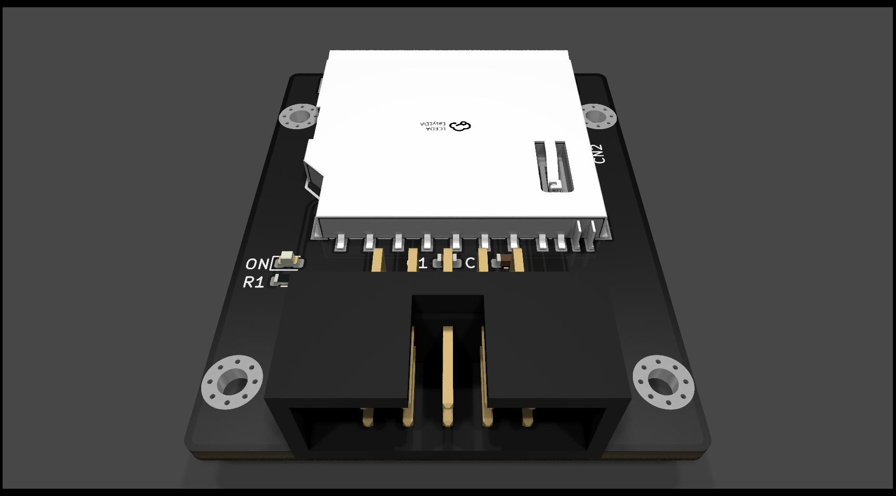
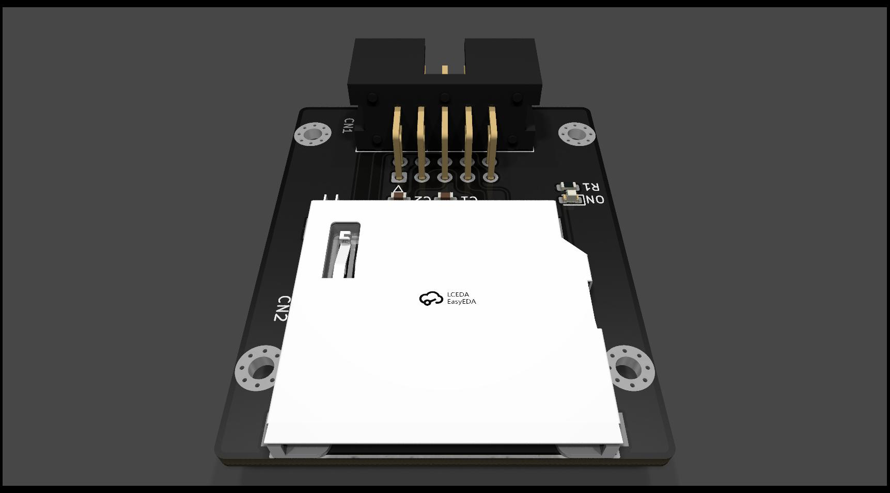
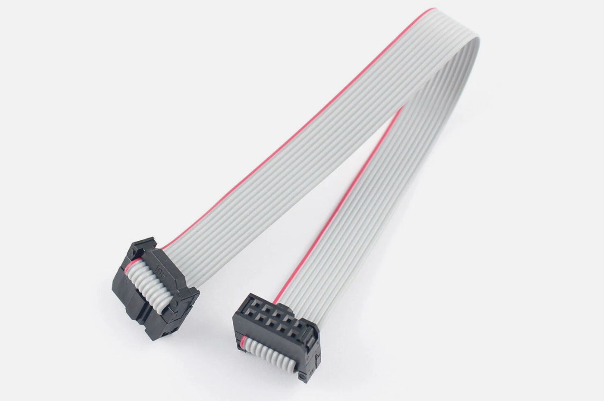

# Vampire SD Card Adapter V1

Alternative SD Card Adapter for your Vampire Standalone, Firebird or Manticore from [Apollo-Computer](https://apollo-computer.com/) where you can direct boot of the card (depending on Core Revision). 

Not compatible with Icedrake.

# Render

# Requierements

An additional IDC cable with 2x5 Pins and 2.54mm Pitch to connect to your Vampire Standalone (P22), Firebird (P22) or Manticore (P22) is needed.

